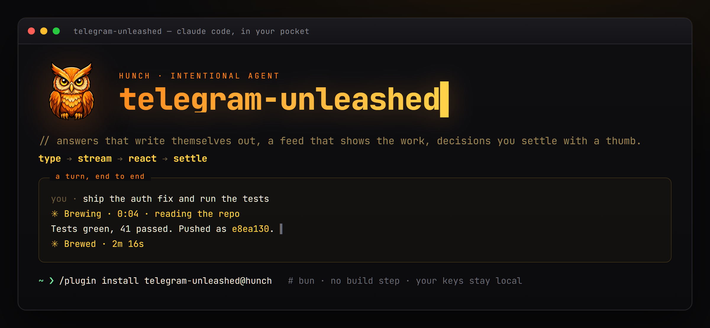

<div align="center">



### Your agent, in your pocket — and it types back.

Telegram channel for Claude Code, rebuilt on Bot API 10.x.
Answers that write themselves out word by word. An activity feed that shows the
work as it happens. Formatting that never breaks, files that behave like files,
and decisions you settle with a thumb.

[](https://github.com/schenkei-code/telegram-unleashed/releases)
[](https://bun.sh)
[](https://core.telegram.org/bots/api)
[](LICENSE)

</div>

---

*Built by **hunch intentional agent**. A fork of the official `telegram`
plugin, whose access-control model is carried over unchanged.*

## Quick start

Six steps, about five minutes. Step 5 is the one everybody misses.

### 1. Requirements

[Claude Code](https://claude.com/claude-code), and [bun](https://bun.sh) — the
server runs TypeScript directly, there is no build step. Node 20+ only if you
want the optional activity feed.

### 2. Create a bot

Message [@BotFather](https://t.me/botfather), send `/newbot`, follow the two
questions. You get a token that looks like `123456789:AAH...`.

### 3. Store the token

The token lives outside the plugin so upgrades never lose it:

```bash
mkdir -p ~/.claude/channels/telegram
echo 'TELEGRAM_BOT_TOKEN=123456789:AAH...' > ~/.claude/channels/telegram/.env
```

On Windows that path is `%USERPROFILE%\.claude\channels\telegram\.env`.

### 4. Install the plugin

```
/plugin marketplace add schenkei-code/telegram-unleashed
/plugin install telegram-unleashed@hunch
```

The marketplace is named `hunch`, hence the `@hunch` — not `@telegram-unleashed`.

To pull a later version:

```
/plugin marketplace update hunch
/plugin update telegram-unleashed@hunch
```

### 5. Start Claude Code with the channel attached

```bash
claude --channels plugin:telegram-unleashed@hunch --dangerously-load-development-channels
```

**This is the step that silently costs people an afternoon.** Installing the
plugin loads its tools, so sending *out* works immediately and everything looks
fine — but inbound messages are only routed to a session that asked for them.
Without `--channels` you can message the bot all day and nothing arrives.

The syntax is strict and undocumented: entries must be tagged, either
`plugin:<name>@<marketplace>` or `server:<name>`. A bare `telegram-unleashed`
is rejected with *entries must be tagged*. The second flag is needed because
this plugin is not on Anthropic's built-in channel allowlist; without it the
entry is refused as a development channel.

### 6. Pair

DM your bot. It answers with a pairing code. Back in Claude Code:

```
/telegram-unleashed:access pair <code>
```

That writes your user id to the allowlist. Now message the bot and the session
answers.

> Only one process may poll a given bot token. Running this alongside the
> official `telegram` plugin on the same token produces a permanent 409 —
> disable one, or give each its own bot.

## What it does differently

**The activity indicator survives.** Telegram clears a chat action after about
five seconds. A turn that takes two minutes used to show "typing…" for the
first five and then nothing, leaving no way to tell a working agent from a dead
one. Here it is re-poked on an interval until output actually goes out.

**Answers type themselves out.** Not a spinner, not a wall of text landing at
once — the message assembles in front of you the way a person types. Short
words spell out letter by letter, longer ones land whole, so the rhythm stays
even instead of stuttering through every long noun.

The pacing runs inside the plugin, which is the whole trick. Streaming driven
from the outside costs one round-trip per chunk, so it moves at the caller's
thinking speed — a few words, a pause, a few more. Hand `reply` the finished
text and it reveals it smoothly on its own. Ordinary replies do this by
default; anything with attachments, pre-formatted markup or a multi-part body
posts whole, because there the reveal would cost something rather than being
free.

**Answers can also stream as you write them.** `stream_start` / `stream_push` /
`stream_end` render a live message via `sendRichMessageDraft` for output that
does not exist yet when the first chunk goes out. Where rich drafts are
unavailable it falls back to edit-based streaming automatically, no caller
changes needed.

**You can watch it work.** An optional hook keeps one live message in sync with
the session: every file read, every edit, every command, interleaved with what
the agent is actually saying between the steps. A two-minute build stops being
two minutes of silence. It only speaks up in sessions a Telegram message
started, so scheduled jobs stay quiet, and a failure inside it can never take
the turn down with it. See [Live activity feed](#live-activity-feed).

**No manual escaping, ever.** The old tool description asked the caller to
escape MarkdownV2's eighteen reserved characters by hand. Write ordinary
Markdown; it becomes valid Telegram HTML and everything else is escaped. A
stray `<`, `&` or an unbalanced `*` can no longer break a message.

**Code blocks don't break.** Splitting a long message at 4096 characters used
to cut through an open `<pre>`, which Telegram rejects outright. Chunking is
HTML-aware: any tag still open at the cut is closed and reopened.

**Files behave like files.** Images, video, audio, voice notes, GIFs and
documents are each sent in their proper form, and several images become an
album instead of eight separate messages. Against Telegram's cloud the upload
ceiling is 50 MB; point `TELEGRAM_API_ROOT` at a local Bot API server and it
becomes 2 GB with unlimited downloads.

**The conversation is remembered.** Telegram hands a bot nothing but the
updates it is online for — there is no API to fetch what was said earlier, and
`getUpdates` forgets within a day. So the plugin keeps its own log: every
message in and out, JSONL, one file per chat, next to the channel's other
state. The `history` tool reads and searches it, which means a restarted agent
can look up what it already promised instead of asking you to paste it back.
`scripts/backfill-history.mjs` seeds the log from existing Claude Code
transcripts, so switching it on does not start you at zero.

**Your commands are in the menu.** The blue command button lists what Claude
Code actually has installed — every skill and slash command, discovered at
startup, so it stays right as you add and remove things. Tap one and the
session runs it. Telegram refuses a command name with a dash or a colon in it,
so `claude-mem:mem-search` is registered as `claude_mem_mem_search` and
translated back on the way in; without that the menu would offer commands that
silently do nothing.

A tapped entry is a bare word with no room for context, so it opens a card with
the skill's full description and a run button rather than firing immediately —
the menu blurb is one clipped line, which is not enough to decide on. Typing a
command *with* arguments skips the card and goes straight through.

A few are answered by the plugin itself, no session required: `/plugins` lists
what is installed with a tick beside each one — tap to turn it on or off —
while `/mcp`, `/commands`, `/history` and `/status` answer questions about the
machine. Toggling takes effect when Claude Code next starts. Access control is
deliberately *not* reachable this way: who may talk to the bridge is decided at
the machine, never by something that arrived over it.

**Decisions are a tap.** `ask` posts a question with buttons and blocks until
one is pressed. `send_plan` does the same for a plan, returning approve or
reject. Permission requests keep the Allow/Deny buttons of the original, plus
an expandable detail view.

## Tools

| Tool | Purpose |
|---|---|
| `reply` | Text and/or files. Markdown in, formatted message out. Types itself out unless there is a reason not to. |
| `say` | Reveal a finished text at a chosen granularity — `natural`, `char`, `word`, `line`, `paragraph`. |
| `send_files` | Files without a text message; albums where applicable. |
| `send_code` | Syntax-highlighted code block, split safely. |
| `ask` | Question with buttons — **blocks until answered**. |
| `send_plan` | Plan with Freigeben/Ablehnen — **blocks until answered**. |
| `stream_start` / `stream_push` / `stream_end` | Live-updating message. |
| `react` | Emoji reaction (Telegram's fixed set). |
| `edit_message` / `delete_message` / `pin_message` | Message management. |
| `send_poll` | Poll. |
| `typing` | Manual indicator control (usually automatic). |
| `download_attachment` | Fetch an inbound file into the inbox. |
| `history` | Read or search what was said in a chat before. |
| `channel_info` | Limits, streaming mode, pending waiters. |

## Configuration

State lives in `~/.claude/channels/<channel>/` — credentials, allowlist,
downloaded attachments — so reinstalling or upgrading the plugin never touches
it.

### Environment

| Variable | Effect |
|---|---|
| `TELEGRAM_BOT_TOKEN` | Required. Read from the channel `.env` if unset. |
| `TELEGRAM_CHANNEL` | State directory name. Default `telegram`; use e.g. `telegram-dev` for a second bot. |
| `TELEGRAM_API_ROOT` | Point at a local Bot API server to lift file limits. |
| `TELEGRAM_ACCESS_MODE=static` | Snapshot access at boot, never write. |

### Local Bot API server (optional, for large files)

```bash
# raises uploads to 2 GB and removes the 20 MB download cap
telegram-bot-api --api-id=<id> --api-hash=<hash> --local --http-port=8081
export TELEGRAM_API_ROOT=http://localhost:8081
```

API credentials come from https://my.telegram.org.

## Settings

`~/.claude/channels/<channel>/access.json`, beyond the original's keys:

| Key | Default | Meaning |
|---|---|---|
| `defaultFormat` | `auto` | `auto` \| `html` \| `markdownv2` \| `text` |
| `typingKeepalive` | `true` | Keep the indicator alive during a turn |
| `typingIntervalSec` | `4` | Re-poke interval |
| `typingMaxSec` | `600` | Hard stop, so a hung turn can't poke forever |
| `streaming` | `true` | Allow live message streaming |
| `streamIntervalMs` | `1200` | Minimum gap between stream updates |
| `reveal` | `true` | Type ordinary replies out instead of posting them whole |
| `revealUnit` | `natural` | `natural` \| `char` \| `word` \| `line` \| `paragraph` |
| `revealTickMs` | `180` | Gap between reveal frames |
| `revealMaxMs` | `3500` | Budget per reveal; longer text takes bigger steps, not longer |
| `linkPreview` | `false` | Show link previews |
| `askTimeoutSec` | `900` | How long `ask`/`send_plan` wait |
| `collapseOver` | `0` | Auto-collapse messages longer than N chars (0 = off) |
| `history` | `true` | Keep a local log of every message in and out |

## Live activity feed

`hooks/activity.mjs` mirrors the session into one Telegram message that rewrites
itself as the work goes on — tool calls and the agent's own prose, interleaved.
Optional, off until you wire it up:

```jsonc
// ~/.claude/settings.json
{
  "hooks": {
    "PreToolUse":       [{ "matcher": "*", "hooks": [{ "type": "command", "command": "node \"/path/to/telegram-unleashed/hooks/activity.mjs\"", "timeout": 10, "async": true }] }],
    "UserPromptSubmit": [{ "hooks": [{ "type": "command", "command": "node \"/path/to/telegram-unleashed/hooks/activity.mjs\"", "timeout": 10, "async": true }] }],
    "Stop":             [{ "hooks": [{ "type": "command", "command": "node \"/path/to/telegram-unleashed/hooks/activity.mjs\"", "timeout": 10, "async": true }] }]
  }
}
```

It reads the channel credentials from disk and finds the chat by looking for an
inbound channel tag in the transcript, so a session nobody messaged writes
nothing at all — cron jobs and local work stay silent. Updates are throttled,
notifications are suppressed, and every failure path exits 0: a broken feed must
never break the turn.

## Not included

**Checklists.** `sendChecklist` requires a `business_connection_id`, meaning a
Telegram Business connection (part of Telegram Premium) where the bot acts on
behalf of a user account. That is a different product from an agent channel,
so a checklist tool would be dead code here. Buttons and polls cover the same
ground.

**"Always allow" on permission prompts.** Claude Code's permission protocol has
`allow` and `deny` and nothing else. A third button would have to lie about
what it does; standing pre-approvals belong in `permissions.allow` in settings.

## Testing

```bash
bun run test/format.test.ts                              # formatter and chunking
TELEGRAM_CHANNEL=telegram-dev bun run test/mcp.test.ts <chat_id>   # end-to-end
```

The end-to-end test spawns the server over stdio exactly as Claude Code does,
verifies the guard rails reject a non-allowlisted chat and refuse to attach
channel state, and sends real messages.

## License

Apache License 2.0 — see [LICENSE](LICENSE) and [NOTICE](NOTICE).

MIT was the intent, but it is not available here: this is a fork of Anthropic's
official `telegram` plugin, which is Apache-2.0, and that licence cannot be
relicensed away. Apache-2.0 grants the same permissions to you — use, modify,
redistribute, commercial use included — and additionally comes with an express
patent grant. What it asks in return is that the notice travels with the code
and that changes are stated, which `NOTICE` does.

---

<div align="center">


*Agents that act on purpose, not on prompt.*

</div>
